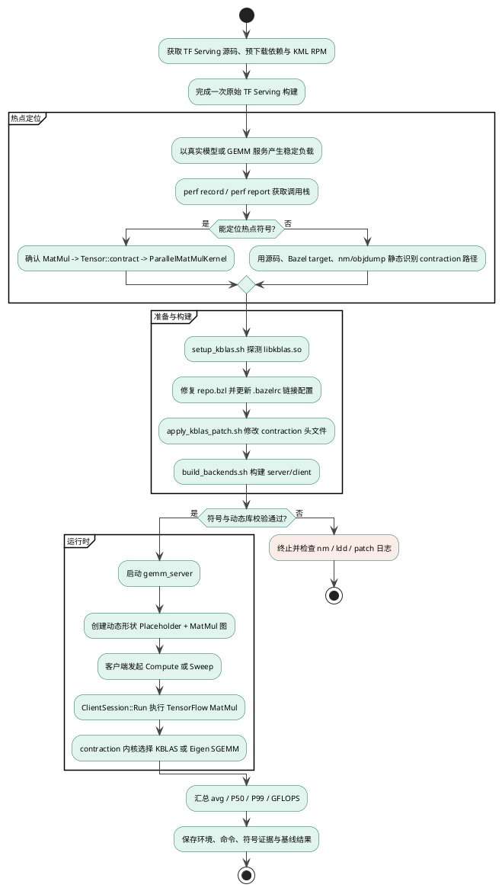
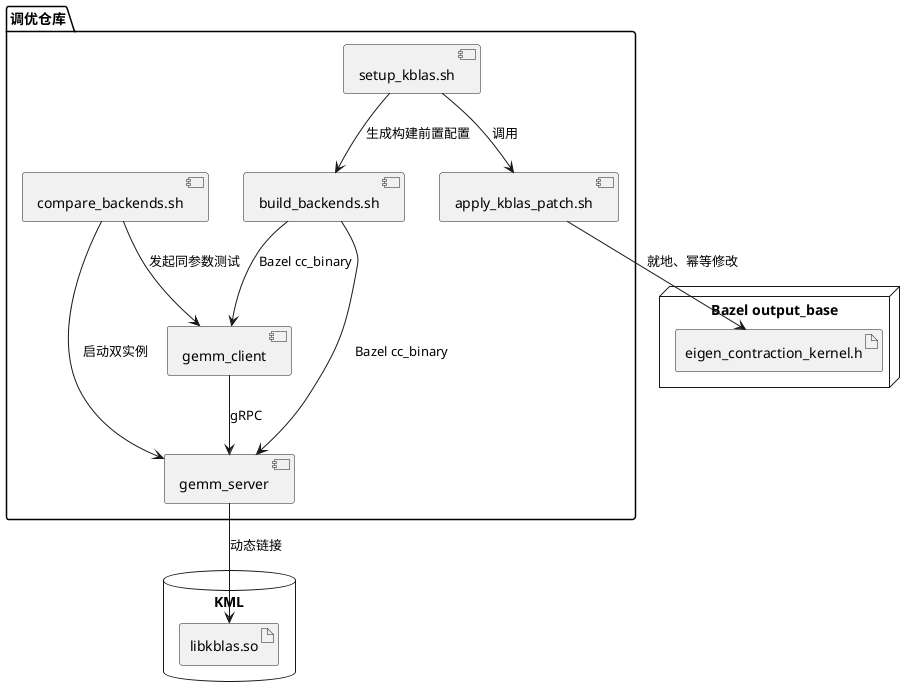
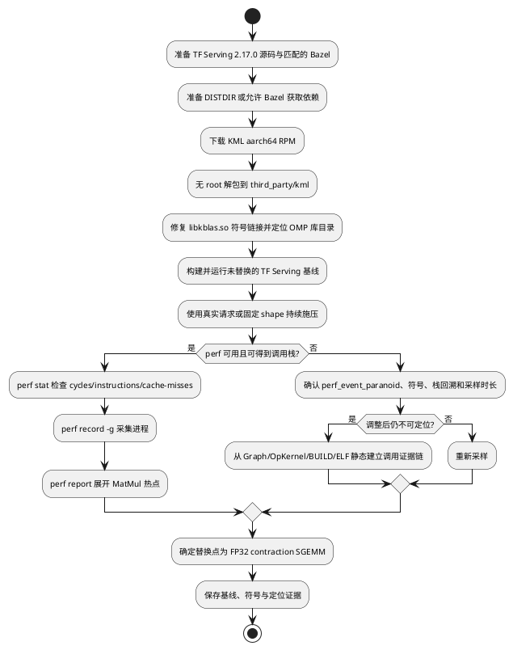
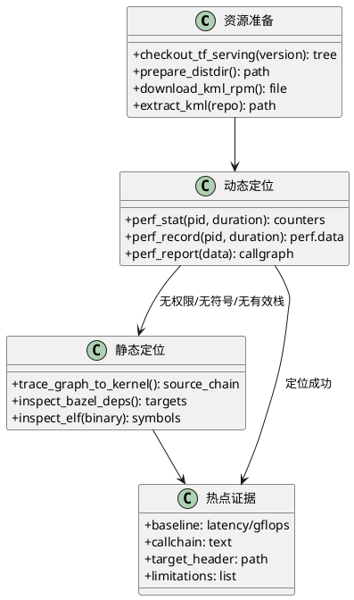
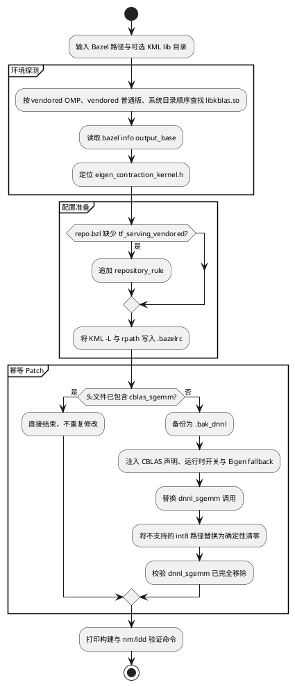
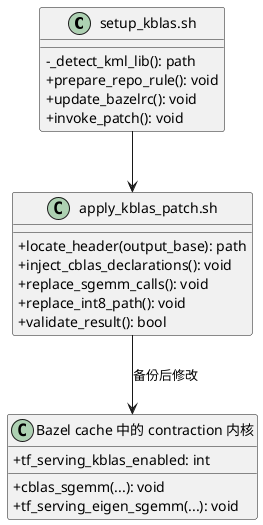
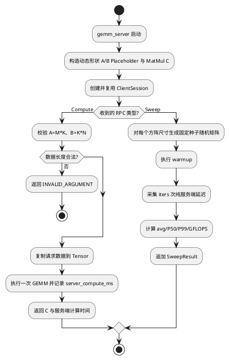
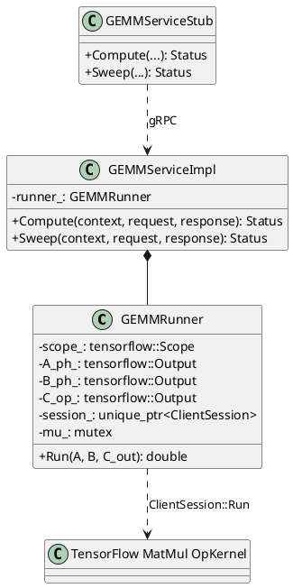
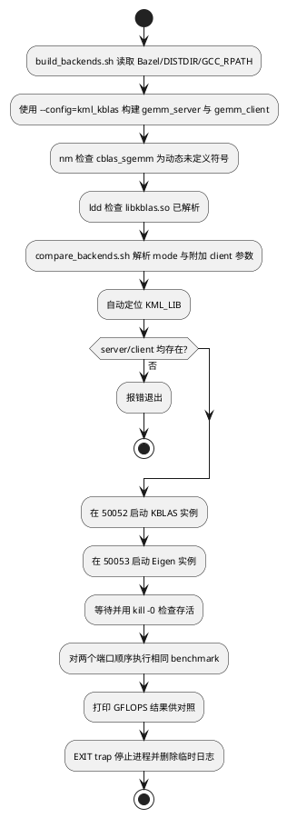
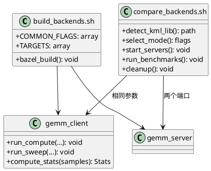

# KBLAS GEMM 调优详设文档

## 1. 设计背景

### 1.1 目的

本设计面向鲲鹏 aarch64 平台上的 TensorFlow Serving 矩阵乘热点，目标是在不改变 TensorFlow Session 上层执行路径的前提下，将 Eigen contraction 内核中的 FP32 GEMM 调用切换到华为 KML `cblas_sgemm`，并提供可重复的构建、运行和性能对比手段。

具体设计目标如下：

1. **最小侵入式内核替换**：不修改 WORKSPACE，不重新组织 TensorFlow 依赖，仅在 Bazel external cache 中对 `eigen_contraction_kernel.h` 做幂等 patch。
2. **同路径后端对比**：KBLAS 与 Eigen 共用 gRPC、`ClientSession::Run`、`MatMul` 和 `Tensor::contract` 调用链，只在 contraction 最底层选择不同的 SGEMM 实现。
3. **可复现基准测试**：提供单矩阵、方阵 sweep 及生产 shape sweep 的自动化入口，统一采集平均延迟、P50、P99 和 GFLOPS。
4. **工程化部署准备**：自动发现 KML 动态库、写入 Bazel 链接参数、校验动态符号与运行时依赖，并保留对既有 TF 编译缓存的复用能力。

### 1.2 需求背景

| 字段 | 内容 |
| --- | --- |
| 优化对象 | TensorFlow Serving 2.17.0 中由 Eigen contraction 承载的 FP32 MatMul |
| 目标平台 | 鲲鹏 aarch64 / openEuler 20.03 LTS SP3 及以上 |
| 优化后端 | boostkit-kml 1.7.0+ 的 `libkblas.so` |
| 构建工具链 | Bazel 7.4.1、GCC 12.3.1+、C++17 |
| 功能分解 | 环境准备与内核 patch、GEMM 服务与协议、双后端基准编排 |

现有 TensorFlow Serving 可以通过 `ClientSession` 执行 `MatMul`，但默认 contraction 路径无法直接利用 KML。若另写一套绕过 TensorFlow 的 KBLAS benchmark，上层调度、Tensor 构造和 OpKernel 路径均不一致，所得性能数据缺少可比性。本仓库因此采用“同一执行链、末级内核二选一”的方式，把变量限制在 SGEMM 实现本身。

---

## 2. 模块整体架构设计

### 2.1 架构整体设计

系统由资源准备、热点定位、内核替换、服务验证和性能对比五个阶段构成。资源准备阶段获取 TensorFlow Serving 与 KML；热点定位阶段优先用 `perf` 确认真实负载的 GEMM 调用栈，在采样条件不足时退化为调用链和符号的静态识别；内核替换阶段定位 Bazel cache 并应用 patch；服务验证阶段通过 gRPC 驱动 TensorFlow `MatMul`；性能对比阶段用相同输入比较 KBLAS 与 Eigen。



整体调用链如下：

```text
gemm_client
  -> gRPC Compute / Sweep
    -> GEMMServiceImpl
      -> GEMMRunner::Run
        -> tensorflow::ClientSession::Run
          -> MatMul OpKernel
            -> Eigen::Tensor::contract
              -> ParallelMatMulKernel
                -> cblas_sgemm (KBLAS) / tf_serving_eigen_sgemm (Eigen)
```

### 2.2 模块边界与部署关系



部署代码以可复制到 TensorFlow 源码树的 Bazel package 形式提供；脚本以仓库根目录为锚点寻找配置、第三方库和构建产物。KML 推荐 vendor 到 `third_party/kml`，以避免 Bazel execution root 对外部 include 路径的限制。

### 2.3 端到端实施阶段

| 阶段 | 输入 | 核心动作 | 输出与准入条件 |
| --- | --- | --- | --- |
| 1. 获取资源 | TF Serving 2.17.0、KML 1.7.0 RPM、Bazel、离线依赖目录 | 下载或复用源码与依赖，将 KML 解包到仓库内 | `libkblas.so` 可解析，TF Serving 原始版本可构建 |
| 2. 建立原始基线 | 未替换的 server、代表性模型或 shape | 固定线程、CPU 亲和性、矩阵集合、预热与迭代次数 | Eigen 基线延迟和 GFLOPS，测试环境记录完整 |
| 3. 动态定位 | 稳态 MatMul 负载、带符号或可回溯 binary | `perf stat` 判断 CPU 特征，`perf record/report` 展开热点调用链 | 确认热点落入 contraction/GEMM，或记录无法定位的原因 |
| 4. 静态兜底 | 源码、BUILD、ELF、Bazel external cache | 检查 Graph 的 MatMul、BUILD 依赖、`nm` 符号和 `objdump` 调用点 | 得到可审计的“图节点→OpKernel→contraction→SGEMM”证据链 |
| 5. KML 替换 | 已定位的 contraction 头文件与 KML 路径 | 运行 setup 和 patch，以 `--config=kml_kblas` 重新构建 | `nm` 出现 `U cblas_sgemm`，`ldd` 正确解析 KML |
| 6. 功能验证 | KBLAS/Eigen 两种后端、相同矩阵 | 比较输出维度、数值误差、错误处理和启动日志 | 结果在约定容差内，日志能证明实际后端 |
| 7. 性能验收 | 相同 binary、相同输入和采样配置 | 重复 sweep/生产 shape 测试，记录 avg/P50/P99/GFLOPS | 给出分 shape 结论、回退范围和完整复现命令 |

各阶段为顺序门禁：原始版本不能构建时不进入 patch；热点证据不足时必须完成静态证据链；符号或动态库验证失败时不得开始性能对比；功能正确性未通过时性能结果无效。

---

## 3. 组件设计

### 组件一：资源获取与 GEMM 热点定位

#### 3.1 组件功能整体流程



**流程说明**：

1. **获取 TensorFlow Serving**：使用与目标环境一致的 2.17.0 源码快照。若目标机器已经成功编译过 TF Serving，应复用该工作树、Bazel `output_base` 和 `DISTDIR`，避免版本漂移以及重新下载大型依赖。
2. **获取 KML**：下载 aarch64 的 boostkit-kml RPM。无 root 场景使用 `rpm2cpio | cpio` 解包到目标 TF Serving 仓库的 `third_party/kml`，使头文件和动态库处于 Bazel execution root 内。
3. **建立未优化基线**：在应用任何 patch 前构建并运行 Eigen 路径。固定 CPU 亲和性、OMP/TF 线程数、矩阵 shape、warmup 与 iters；后续 KML 测试必须复用这些条件。
4. **动态定位优先**：对稳定运行的服务进程先执行 `perf stat`，再以 99 Hz 左右频率采集调用栈。`perf report` 中应从 TensorFlow `MatMul`/执行器热点继续展开到 Eigen contraction、`ParallelMatMulKernel` 或 SGEMM 相关符号。
5. **定位失败诊断**：`perf` 没有热点不等于没有 GEMM。常见原因包括 `kernel.perf_event_paranoid` 限制、binary 被 strip、缺少 frame pointer/DWARF、内联导致符号折叠、采样窗口过短、请求未进入预期图或负载被其他线程稀释。应逐项记录而不是直接判定替换点。
6. **静态识别兜底**：动态采样仍不可用时，从服务端构图中的 `tfops::MatMul` 出发，检查 Bazel 的 `cc_ops`/`core_cpu` 依赖，再在 external TensorFlow 源码中追踪 MatMul OpKernel 到 `Eigen::Tensor::contract` 和 `eigen_contraction_kernel.h`；结合 `nm -C`、`readelf -Ws`、`objdump -dC` 证明目标 binary 中包含对应符号或调用引用。
7. **替换范围控制**：本期只替换 FP32 SGEMM。KML 不支持的 int8 路径不纳入本次性能结论；小矩阵可能因调用和线程调度开销退化，需保留 Eigen 回退能力。

#### 3.2 模块结构图



#### 3.3 接口设计

**资源获取接口**：

```bash
git clone --branch 2.17.0 <TF_SERVING_GIT_URL> "$REPO"

wget -O /tmp/boostkit-kml-1.7.0-1.aarch64.rpm \
  https://repo.oepkgs.net/openeuler/rpm/openEuler-20.03-LTS-SP3/extras/aarch64/Packages/b/boostkit-kml-1.7.0-1.aarch64.rpm
mkdir -p "$REPO/third_party/kml"
rpm2cpio /tmp/boostkit-kml-1.7.0-1.aarch64.rpm | \
  cpio -idmv --no-absolute-filenames -D "$REPO/third_party/kml"

KML_LIB=$(dirname "$(find "$REPO/third_party/kml" -name libkblas.so \
  -path '*/omp/*' -print -quit)")
```

`<TF_SERVING_GIT_URL>` 必须由项目使用的代码托管地址替换；文档不固化镜像站，以免下载到与生产构建不一致的 fork。下载后需记录 commit ID，并校验 RPM 架构为 aarch64。若网络受限，RPM 与 Bazel 依赖应在联网环境下载后放入受控制品库或 `DISTDIR`，目标机只做离线解包和构建。

**动态热点定位接口**：

```bash
PID=$(pgrep -n gemm_server)
perf stat -p "$PID" -e cycles,instructions,cache-references,cache-misses \
  -- sleep 30
perf record -F 99 -g --call-graph dwarf -p "$PID" -- sleep 60
perf report --stdio --children --sort=dso,symbol | less
perf script > perf.script.txt
```

若编译产物保留 frame pointer，可将 `--call-graph dwarf` 改为开销更低的 `fp`；否则应继续使用 DWARF。对多线程服务必须以 `-p PID` 覆盖进程全部线程，不要只采样主线程 TID。采样期间应持续发送请求，并在记录中保存 QPS、shape、线程配置和 CPU 亲和性。

**静态识别接口**：

```bash
rg -n 'MatMul|Tensor::contract|ParallelMatMulKernel|dnnl_sgemm' \
  deployment "$($BAZEL info output_base)/external/org_tensorflow"
nm -C bazel-bin/tf_serving_gemm/tf_gemm_server/gemm_server | \
  rg 'MatMul|contract|ParallelMatMulKernel|sgemm'
readelf -Ws bazel-bin/tf_serving_gemm/tf_gemm_server/gemm_server | rg 'sgemm|MatMul'
objdump -dC bazel-bin/tf_serving_gemm/tf_gemm_server/gemm_server | \
  rg -n 'cblas_sgemm|dnnl_sgemm|ParallelMatMulKernel'
```

静态证据至少包含三层：服务图中确有 `MatMul` 节点、构建依赖会链接 TensorFlow CPU OpKernel、external TensorFlow 源码或 ELF 指向 contraction SGEMM。仅搜索到函数名不能证明运行时一定走该路径，因此最终报告应将其标记为“静态识别”，并在具备 perf 条件后补做动态验证。

#### 3.4 存储数据设计及描述

- **下载制品**：KML RPM、TF Serving commit ID、Bazel 版本和依赖清单应纳入项目制品记录；RPM 建议同时保存 SHA-256。
- **性能原始数据**：保留 `perf.data`、`perf.script.txt`、`perf report --stdio` 输出以及对应的负载参数；`perf.data` 与具体 binary/build-id 绑定，不应脱离构建产物单独归档。
- **定位报告**：记录动态热点、静态调用证据、未解析符号、权限限制与最终替换文件，避免后续升级 TF 时沿用失效结论。

---

### 组件二：环境准备与 contraction 内核 patch

#### 3.1 组件功能整体流程



**流程说明**：

1. **库目录探测**：优先选择仓库内 `third_party/kml/lib/kblas/omp`，其次检查非 OMP 和扁平目录，最后退化到 `/usr/local/kml/lib`；用户显式传入目录时覆盖自动结果。
2. **Bazel 配置修复**：`setup_kblas.sh` 检查 TF Serving 的 `repo.bzl`，缺少 `tf_serving_vendored` 时追加实现；随后更新 `.bazelrc` 中 `kml_kblas` 配置的 `-L` 与 `rpath`。
3. **缓存内 patch**：脚本通过 `bazel info output_base` 定位 external TensorFlow 头文件，不改 WORKSPACE，从而避免依赖重新 fetch 和历史编译缓存失效。
4. **运行时选择点**：patch 将原 `dnnl_sgemm` 调用改写为 `tf_serving_kblas_enabled` 控制的分支。KBLAS 分支调用 `cblas_sgemm`，对照分支调用签名一致的 Eigen fallback。
5. **兼容与失败保护**：正则不能匹配当前 TF 版本时打印实际片段；最终仍存在 `dnnl_sgemm` 时以非零状态退出，避免产生“看似构建成功、实际未替换”的二义性。
6. **幂等性**：以 `cblas_sgemm` 标记判断是否已 patch；setup 中的 repo 与链接配置也先检查后修改，可多次执行。

#### 3.2 模块结构图



#### 3.3 接口设计

**外部命令接口**：

```bash
bash scripts/setup_kblas.sh [BAZEL_BIN] [KML_LIB_DIR]
bash scripts/apply_kblas_patch.sh [BAZEL_BIN]
```

**环境变量接口**：

| 名称 | 含义 | 默认行为 |
| --- | --- | --- |
| `BAZEL` | Bazel 可执行文件 | 从 `PATH` 查找 |
| `KML_LIB_DIR` / 脚本第二参数 | `libkblas.so` 所在目录 | 按预设目录自动探测 |
| `BAZEL_DISTDIR` | 预下载依赖目录 | `<repo>/../tf_new/dist` |
| `GCC_RPATH` | GCC runtime 搜索路径 | 根据当前 `gcc` 位置推导 |

#### 3.4 存储数据设计及描述

- **头文件备份**：首次 patch 前生成 `eigen_contraction_kernel.h.bak_dnnl`，用于问题定位。
- **Bazel 配置**：KML 编译宏、OpenMP、架构优化、链接库和 rpath 保存在目标 TF Serving 仓库的 `.bazelrc`。
- **KML 动态库**：推荐保存在目标仓库 `third_party/kml` 下；运行时仍可通过 `LD_LIBRARY_PATH` 显式指定。

---

### 组件三：GEMM gRPC 服务与数据协议

#### 3.1 组件功能整体流程



**流程说明**：

1. **图复用**：`GEMMRunner` 在构造阶段只创建一次动态形状计算图和 `ClientSession`，不同矩阵尺寸无需重建图。
2. **串行保护**：`Run()` 以 mutex 包围 `ClientSession::Run`，避免同一 Session 被并发请求交叉使用；计时范围仅覆盖 Session 执行和输出获取。
3. **Compute 模式**：客户端提交 row-major A、B 与 M/K/N。服务端先校验元素数量，随后执行 `C=A*B`，响应中同时返回结果矩阵和服务端耗时。
4. **Sweep 模式**：矩阵由服务端以固定种子生成，减少大矩阵经 gRPC 往返对计时的污染；每个尺寸先预热，再统计延迟分位数。
5. **吞吐计算**：按 FP32 GEMM 浮点操作数 `2*M*K*N` 计算 GFLOPS；平均耗时由毫秒换算为秒。
6. **消息容量**：server 将 gRPC 收发上限设为 256 MiB，以容纳 Compute 模式下较大的 A、B、C 数组。

#### 3.2 模块结构图



#### 3.3 接口设计

**服务接口**：

```protobuf
rpc Compute(ComputeRequest) returns (ComputeResponse);
rpc Sweep(SweepRequest) returns (SweepResponse);
```

| 消息 | 核心字段 | 约束或语义 |
| --- | --- | --- |
| `ComputeRequest` | `a_data`, `b_data`, `M`, `K`, `N` | A 为 M×K，B 为 K×N，均按 row-major 传输 |
| `ComputeResponse` | `c_data`, `server_compute_ms` | C 为 M×N；耗时不含客户端网络往返 |
| `SweepRequest` | `sizes`, `iters`, `warmup` | 每个 size 测试 size×size；非正采样数由服务端使用默认值 |
| `SweepResult` | `M/K/N`, `avg/p50/p99_ms`, `gflops` | 每个尺寸一条统计结果 |

**服务进程命令接口**：

```bash
gemm_server [--addr=0.0.0.0:50052]
gemm_client --host=<host:port> --mode=sweep \
  --sizes=128,256,512,1024,2048 --iters=50 --warmup=10
gemm_client --host=<host:port> --mode=compute \
  --M=512 --K=512 --N=512 --iters=50 --warmup=10
```

> 部署模板中的 `server.cc` 当前只解析 `--addr`。双后端脚本所使用的 `--backend` 依赖目标 TF Serving 集成版本对 server 入口和 patch 中全局开关完成接线；在移植本目录代码时应将该接线作为集成检查项，不能仅以编译成功判定后端切换有效。

#### 3.4 存储数据设计及描述

本组件不使用持久化数据库。计算图、Session、请求 Tensor 和采样数组均位于进程内存；响应通过 protobuf 序列化。随机矩阵使用固定种子 42 生成，以提高同尺寸重复测试的一致性。

---

### 组件四：构建与双后端性能对比编排

#### 3.1 组件功能整体流程



**流程说明**：

1. **统一构建**：`build_backends.sh` 使用相同优化、依赖目录、编译器和链接器参数构建 server/client，并通过 `--config=kml_kblas` 启用 KML contraction 配置。
2. **运行实例隔离**：比较脚本使用同一 server binary 在 50052、50053 启动两个进程，日志分别写入 `/tmp/kblas_server.log` 与 `/tmp/eigen_server.log`。
3. **启动失败快检**：等待初始化后通过 `kill -0` 验证进程；任一实例退出即展示对应日志并终止测试，不输出误导性的空结果。
4. **模式选择**：`sweep` 覆盖 128～2048 方阵，`compute` 用于单个 M×K×N，脚本还预留 `shape_sweep` 作为生产 shape 集入口。
5. **参数覆盖**：模式提供默认 `iters`/`warmup`/`sizes`，用户追加的 client 参数位于命令末尾，用于覆盖默认采样配置。
6. **资源清理**：EXIT trap 对正常完成和异常退出都执行 server 停止与临时日志删除，避免端口占用影响下一轮测试。

#### 3.2 模块结构图



#### 3.3 接口设计

```bash
bash scripts/build_backends.sh [BAZEL_BIN]
bash scripts/compare_backends.sh [sweep|shape_sweep|compute] [EXTRA_CLIENT_FLAGS...]
```

构建产物约定：

```text
bazel-bin/tf_serving_gemm/tf_gemm_server/gemm_server
bazel-bin/tf_serving_gemm/tf_gemm_server/gemm_client
```

后端有效性校验接口：

```bash
nm -D bazel-bin/tf_serving_gemm/tf_gemm_server/gemm_server | grep cblas_sgemm
ldd bazel-bin/tf_serving_gemm/tf_gemm_server/gemm_server | grep kblas
```

`nm` 预期显示 `U cblas_sgemm`，表示符号由动态库提供；`ldd` 必须能将 `libkblas.so` 解析到实际 KML 路径。两项校验均通过后才进入性能对比。

#### 3.4 存储数据设计及描述

- **构建产物**：由 Bazel 写入 `bazel-bin`，KBLAS/Eigen 使用同一个 server 可执行文件。
- **临时日志**：比较期间使用 `/tmp/kblas_server.log` 和 `/tmp/eigen_server.log`，脚本退出时清理。
- **基线结果**：实测数据以 Markdown 表格维护在 `references/performance-baseline.md`，不由服务自动持久化。

---

## 4. 开发者测试

本设计涉及外部 Bazel cache 修改、动态链接、gRPC 服务和硬件相关性能，测试以目标鲲鹏环境上的集成测试为主，并辅以脚本静态检查。

### 4.1 环境准备与幂等性测试

```bash
export REPO=/path/to/tf_serving
export BAZEL=/path/to/bazel-7.4.1
cd "$REPO"

bash scripts/setup_kblas.sh "$BAZEL" "$KML_LIB"
bash scripts/setup_kblas.sh "$BAZEL" "$KML_LIB"
```

**验收**：第二次执行不得重复追加 `tf_serving_vendored`，不得重复 patch 头文件；应明确输出 already present/already patched 类提示。WORKSPACE 内容和既有 dependency fetch 状态不应变化。

同时记录以下资源信息，确保下载和构建输入可追溯：

```bash
git -C "$REPO" rev-parse HEAD
sha256sum /tmp/boostkit-kml-1.7.0-1.aarch64.rpm
rpm -qp --queryformat '%{NAME} %{VERSION}-%{RELEASE} %{ARCH}\n' \
  /tmp/boostkit-kml-1.7.0-1.aarch64.rpm
"$BAZEL" --version
```

**验收**：TF Serving commit、RPM SHA-256、RPM 架构和 Bazel 版本均写入测试记录；RPM 必须为 aarch64，KML 库必须来自本次记录的制品。

### 4.2 构建与链接验证

```bash
bash scripts/build_backends.sh "$BAZEL"
nm -D bazel-bin/tf_serving_gemm/tf_gemm_server/gemm_server | grep cblas_sgemm
ldd bazel-bin/tf_serving_gemm/tf_gemm_server/gemm_server | grep kblas
```

**验收**：server/client 构建完成；`cblas_sgemm` 显示为由共享库解析的未定义动态符号；`libkblas.so` 不得显示 `not found`。

### 4.3 协议正确性测试

```bash
export LD_LIBRARY_PATH="$KML_LIB:${LD_LIBRARY_PATH:-}"
./bazel-bin/tf_serving_gemm/tf_gemm_server/gemm_server \
  --addr=0.0.0.0:50052

./bazel-bin/tf_serving_gemm/tf_gemm_server/gemm_client \
  --host=localhost:50052 --mode=compute \
  --M=512 --K=512 --N=512 --iters=20 --warmup=5
```

**验收**：服务正常启动；Compute 返回 M×N 个结果；客户端同时显示 RTT、服务端 avg/P50/P99 和基于服务端耗时计算的 GFLOPS。另需构造 A/B 元素数量与 M/K/N 不一致的请求，确认服务返回 `INVALID_ARGUMENT`。

### 4.4 双后端性能对比

```bash
bash scripts/compare_backends.sh sweep
bash scripts/compare_backends.sh compute --M=2048 --K=2048 --N=2048 \
  --iters=30 --warmup=5
```

**验收**：

- 两个实例分别监听 50052 和 50053，且启动日志能够确认实际选择的 backend。
- 两端接收完全相同的尺寸、预热轮数和采样轮数。
- 每个尺寸均输出有效 avg/P50/P99/GFLOPS，不得只有表头或零条结果。
- 脚本结束后两个 server 进程均被回收，临时日志被删除。
- 性能结论按矩阵 shape 分析，不以单个尺寸推导所有负载；小矩阵和异常 shape 需保留 Eigen 对照数据。

### 4.5 perf 动态热点定位测试

```bash
PID=$(pgrep -n gemm_server)
perf stat -p "$PID" -e cycles,instructions,cache-references,cache-misses \
  -- sleep 30
perf record -F 99 -g --call-graph dwarf -p "$PID" -- sleep 60
perf report --stdio --children --sort=dso,symbol > perf-report.txt
```

**验收**：采样窗口内持续有固定 shape 请求；报告能识别 TensorFlow 执行器、MatMul、Eigen contraction 或其下层 GEMM 热点，并保存 perf 版本、kernel、binary build-id、线程配置和请求参数。若调用栈显示 `[unknown]` 或只看到 gRPC/调度线程，应先增加负载和采样时长，再检查符号、DWARF 与 `perf_event_paranoid`，不得直接进入替换结论。

### 4.6 perf 无法定位时的静态识别测试

```bash
OUTPUT_BASE=$("$BAZEL" info output_base)
rg -n 'MatMul|Tensor::contract|ParallelMatMulKernel|dnnl_sgemm' \
  deployment "$OUTPUT_BASE/external/org_tensorflow"
nm -C bazel-bin/tf_serving_gemm/tf_gemm_server/gemm_server | \
  rg 'MatMul|contract|ParallelMatMulKernel|sgemm'
readelf -Ws bazel-bin/tf_serving_gemm/tf_gemm_server/gemm_server | \
  rg 'sgemm|MatMul'
```

**验收**：测试记录必须同时给出：①服务构图中的 `MatMul`；②BUILD 中 TensorFlow CPU runtime/OpKernel 依赖；③external TensorFlow 的 contraction 实现或 binary 符号。若 binary 被 strip 导致后两项无法从 ELF 获取，应保存同 build-id 的未剥离文件或 Bazel 中间产物。报告标题须注明“静态识别，待动态验证”。

### 4.7 静态与文档一致性检查

```bash
bash -n scripts/setup_kblas.sh \
  scripts/apply_kblas_patch.sh \
  scripts/build_backends.sh \
  scripts/compare_backends.sh

git diff --check
```

**验收**：Shell 语法检查和空白检查均通过；文档中的脚本路径、Bazel target、端口、RPC 字段和产物路径应与仓库代码一致。对于部署模板尚未直接实现的 `--backend`/`shape_sweep` 接线，测试报告必须明确标记为集成前置项，不得以设计描述替代运行验证。
