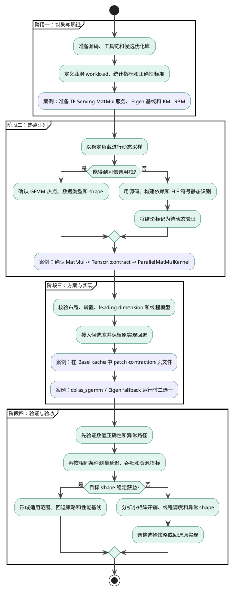
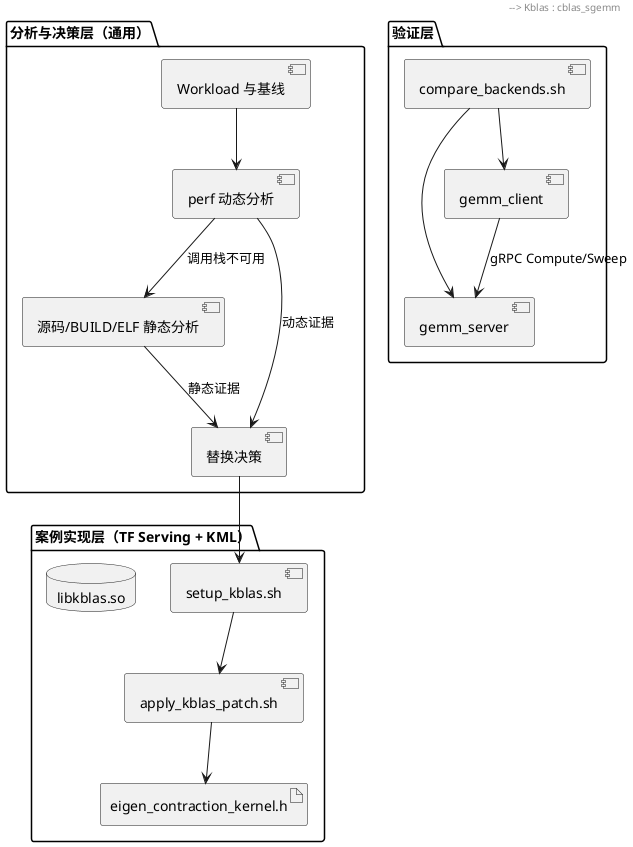
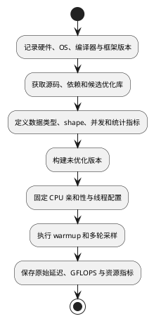
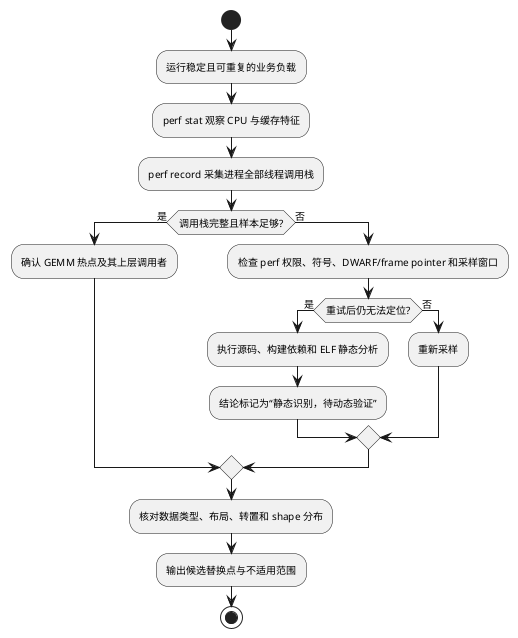
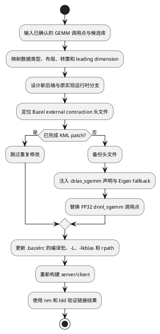
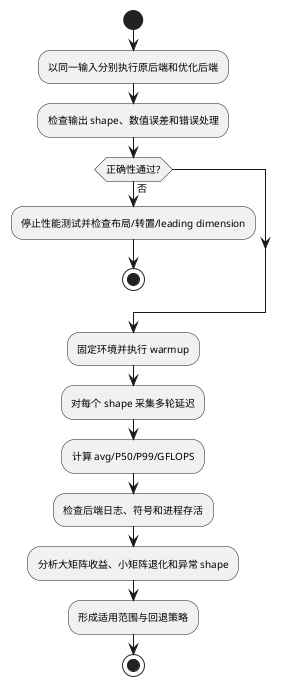

# 矩阵乘内核优化详设文档——TensorFlow Serving KML 替换实践

## 1. 设计背景

### 1.1 目的

本文给出一套可复用的 CPU 矩阵乘内核替换流程，主线遵循“确定对象、建立基线、定位热点、选择方案、实现替换、验证收益”的通用性能优化方法。TensorFlow Serving FP32 MatMul 替换为鲲鹏 KML 不是另一套并列流程，而是贯穿各阶段的实践案例：文档先说明该阶段对任意 GEMM 调用方的要求，再说明本仓库如何在案例中落实这些要求。

本期目标如下：

1. **流程通用化**：热点定位和内核替换方法不依赖某个固定框架，可复用于其他 GEMM 调用方。
2. **案例可落地**：以 TensorFlow Serving 为例，保持 gRPC、TensorFlow Graph、`ClientSession::Run`、MatMul OpKernel 和 Eigen contraction 上层路径不变，仅替换末级 FP32 SGEMM。
3. **结果可归因**：优化前后使用相同 binary 入口、输入 shape、线程配置和统计口径，避免把网络、Graph 构建或输入生成差异误判为内核收益。
4. **过程可复现**：记录源码版本、KML 制品、构建参数、动态调用栈、静态证据和基线数据，支持回归与审计。

### 1.2 需求背景

| 字段 | 内容 |
| --- | --- |
| 通用优化对象 | CPU 上占用显著的 FP32 GEMM/MatMul 调用 |
| 实践案例 | TensorFlow Serving 2.17.0 的 Eigen contraction 路径替换为 KML |
| 目标平台 | 鲲鹏 aarch64 / openEuler 20.03 LTS SP3 及以上 |
| 优化库 | boostkit-kml 1.7.0+，运行时依赖 `libkblas.so` |
| 构建环境 | Bazel 7.4.1、GCC 12.3.1+、C++17 |
| 功能分解 | 分析对象准备、热点识别、优化方案与集成、正确性验证、性能验收 |

通用 GEMM 优化不能从“替换一个函数名”直接开始。首先要证明目标负载确实消耗在矩阵乘内核，然后确认矩阵数据类型、布局、转置语义和尺寸分布，最后才能选择适合的高性能库。本仓库以 TensorFlow Serving 为案例，把 Graph 到 OpKernel 的间接调用、Eigen 模板内联、Bazel external cache、动态库链接和同路径后端切换分别映射到上述通用步骤中。

---

## 2. 模块整体架构设计

### 2.1 架构整体设计

整体过程以通用性能优化闭环为主线，TensorFlow Serving/KML 案例在相应阶段给出具体实现和验证证据：



该流程设置四道门禁：没有可复现基线，不进入热点判断；没有动态或静态证据，不进入内核替换；符号与动态库校验失败，不进入功能测试；数值正确性未通过，不接受任何性能结果。

### 2.2 架构分层



---

## 3. 组件设计

### 组件一：分析对象与基线管理

#### 3.1 组件功能整体流程



**通用流程说明**：

1. **对象边界**：明确优化对象是 FP32 GEMM，而不是完整模型端到端推理。基线既要包含内核计算时间，也要区分客户端 RTT，防止网络序列化影响内核结论。
2. **Workload 选择**：不能只使用单个方阵。至少覆盖小、中、大方阵和真实业务 M×K×N，并固定 warmup、iters、并发度和随机种子。
3. **运行条件**：记录 CPU 型号、NUMA、频率策略、CPU affinity、线程数和系统负载。优化前后仅允许改变被比较的 GEMM 后端。
4. **统计口径**：同时保留 avg、P50、P99 和 GFLOPS；GFLOPS 按 `2*M*K*N / seconds / 1e9` 计算。

**案例落地：TensorFlow Serving 使用 KML**：

通用流程中的“准备对象、固定 Workload、生成原始基线”，在本案例中对应以下操作：

1. 使用与目标环境一致的 TF Serving 2.17.0 工作树，并优先复用已经成功构建的 Bazel `output_base` 与 `DISTDIR`。
2. 将 `deployment/tf_serving_gemm` 作为 Bazel package 集成到目标工作树。server 构造动态形状 Placeholder 和 `MatMul` 图，client 通过 gRPC 执行单次 Compute 或方阵 Sweep。
3. 在应用 KML patch 之前先生成 Eigen 基线。Graph 和 `ClientSession` 在进程内复用，避免每次请求重建图。
4. 将 KML aarch64 RPM 作为本案例的候选实现；无 root 环境通过 `rpm2cpio` 解包到 TF Serving 的 `third_party/kml`，避免 Bazel execution root 拒绝外部 include 路径。

#### 3.2 接口设计

```bash
git clone --branch 2.17.0 <TF_SERVING_GIT_URL> "$REPO"

wget -O /tmp/boostkit-kml-1.7.0-1.aarch64.rpm \
  https://repo.oepkgs.net/openeuler/rpm/openEuler-20.03-LTS-SP3/extras/aarch64/Packages/b/boostkit-kml-1.7.0-1.aarch64.rpm
mkdir -p "$REPO/third_party/kml"
rpm2cpio /tmp/boostkit-kml-1.7.0-1.aarch64.rpm | \
  cpio -idmv --no-absolute-filenames -D "$REPO/third_party/kml"

git -C "$REPO" rev-parse HEAD
sha256sum /tmp/boostkit-kml-1.7.0-1.aarch64.rpm
"$BAZEL" --version
```

`<TF_SERVING_GIT_URL>` 由项目实际代码托管地址替换。离线环境应预先将 RPM 和 Bazel 依赖放入受控制品库或 `DISTDIR`，不得在不同测试轮次临时切换依赖来源。

#### 3.3 存储数据设计及描述

- **环境记录**：TF Serving commit、Bazel/GCC 版本、OS/kernel、CPU、KML RPM SHA-256。
- **Workload 记录**：shape、数据类型、随机种子、warmup、iters、并发和线程配置。
- **基线记录**：原始逐次采样与汇总表分别保存，避免只保留平均值。

---

### 组件二：热点识别与替换点决策

#### 3.1 组件功能整体流程



**通用流程说明**：

1. **动态分析优先**：`perf stat` 用于判断 cycles、instructions 和 cache miss 特征；`perf record -g` 用于回答“时间实际花在哪个调用链”。必须在采样期间持续施压。
2. **不可定位诊断**：依次排查 `kernel.perf_event_paranoid`、binary strip、缺少 DWARF/frame pointer、模板内联、采样时长不足、负载过低和只采到主线程等问题。
3. **静态分析边界**：静态分析只能证明代码和链接路径存在，不能证明生产请求一定执行该路径，因此静态结果必须保留限制说明。
4. **替换决策**：除热点比例外，还要核对候选库是否支持数据类型、矩阵布局、转置、leading dimension、线程模型和典型 shape。

**案例落地：在 TensorFlow Serving 中确认替换点**：

通用流程要求从业务入口确认到 GEMM 内核的完整证据链。本案例将这条证据链具体映射为：

1. 动态调用链从 TensorFlow executor/MatMul OpKernel 展开到 `Eigen::Tensor::contract`、`ParallelMatMulKernel` 或 SGEMM 相关符号；Eigen 模板大量内联时允许从邻近符号和源码位置组合判断。
2. 静态兜底从 `server.cc` 的 `tfops::MatMul` 开始，检查 BUILD 中 `//tensorflow/cc:cc_ops`、`//tensorflow/core:core_cpu` 等依赖，再进入 Bazel `output_base/external/org_tensorflow` 查找 contraction 实现。
3. 本期候选替换点限定为 FP32 contraction SGEMM。int8 路径和非 MatMul 热点不纳入 KBLAS 性能结论。

#### 3.2 接口设计

**动态分析接口**：

```bash
PID=$(pgrep -n gemm_server)
perf stat -p "$PID" -e cycles,instructions,cache-references,cache-misses \
  -- sleep 30
perf record -F 99 -g --call-graph dwarf -p "$PID" -- sleep 60
perf report --stdio --children --sort=dso,symbol > perf-report.txt
perf script > perf-script.txt
```

若 binary 保留 frame pointer，可将 DWARF 改为开销较低的 `--call-graph fp`。`-p PID` 用于覆盖进程全部线程；不能用单个 TID 代替整个多线程服务。

**静态识别接口**：

```bash
OUTPUT_BASE=$("$BAZEL" info output_base)
rg -n 'MatMul|Tensor::contract|ParallelMatMulKernel|dnnl_sgemm' \
  deployment "$OUTPUT_BASE/external/org_tensorflow"
nm -C bazel-bin/tf_serving_gemm/tf_gemm_server/gemm_server | \
  rg 'MatMul|contract|ParallelMatMulKernel|sgemm'
readelf -Ws bazel-bin/tf_serving_gemm/tf_gemm_server/gemm_server | \
  rg 'MatMul|sgemm'
objdump -dC bazel-bin/tf_serving_gemm/tf_gemm_server/gemm_server | \
  rg -n 'ParallelMatMulKernel|dnnl_sgemm|cblas_sgemm'
```

静态证据至少包含三层：Graph 存在 MatMul、构建依赖包含 CPU OpKernel、external TF 源码或 ELF 指向 contraction。若优化 binary 已 strip，应保存同 build-id 的未剥离 binary 或 Bazel 中间产物。

#### 3.3 存储数据设计及描述

- `perf.data` 必须与对应 binary、build-id、kernel 版本和压测参数一起归档。
- 保存 `perf report --stdio` 和 `perf script` 文本，便于无原环境时审查。
- 静态报告需记录查询命令、命中源码、BUILD 依赖、符号证据和可信度等级。

---

### 组件三：优化方案与构建集成

#### 3.1 组件功能整体流程



**通用流程说明**：

1. 替换前必须建立旧 API 到新 API 的参数映射，特别是 row-major/column-major、M/N/K、transpose、lda/ldb/ldc 和 alpha/beta。
2. 优化实现必须保留原后端回退，以便正确性对照、性能回归和不适用 shape 的动态选择。
3. 编译成功不代表替换生效；必须同时验证目标符号、动态库解析和运行日志。

**案例落地：将 Eigen contraction 替换为 KML**：

通用流程中的“语义映射、接入候选库、保留回退、验证生效”，在本案例中实现为：

1. `setup_kblas.sh` 自动发现 KML 库，补充缺失的 `tf_serving_vendored`，并更新目标工作树 `.bazelrc` 中 `kml_kblas` 的链接路径。
2. `apply_kblas_patch.sh` 通过 `bazel info output_base` 找到 `eigen_contraction_kernel.h`，不修改 WORKSPACE，避免 TensorFlow external 仓库重新 fetch。
3. patch 将 FP32 `dnnl_sgemm` 点改为由 `tf_serving_kblas_enabled` 控制的 `cblas_sgemm`/`tf_serving_eigen_sgemm` 分支，并以 `cblas_sgemm` 标记保证重复执行安全。
4. 脚本对无法识别的 TF 版本打印实际代码片段，并在 `dnnl_sgemm` 仍残留时失败退出。
5. 当前部署模板的 `server.cc` 只解析 `--addr`；目标 TF Serving 集成版本还必须把 `--backend` 接到 `tf_serving_kblas_enabled`。该接线未完成时，不能声称双后端切换有效。

#### 3.2 接口设计

```bash
bash scripts/setup_kblas.sh [BAZEL_BIN] [KML_LIB_DIR]
bash scripts/apply_kblas_patch.sh [BAZEL_BIN]
bash scripts/build_backends.sh [BAZEL_BIN]

nm -D bazel-bin/tf_serving_gemm/tf_gemm_server/gemm_server | \
  grep cblas_sgemm
ldd bazel-bin/tf_serving_gemm/tf_gemm_server/gemm_server | \
  grep kblas
```

`nm` 预期显示 `U cblas_sgemm`，表示符号由动态库提供；`ldd` 必须将 `libkblas.so` 解析到本次记录的 KML 制品目录。运行时还应设置：

```bash
export LD_LIBRARY_PATH="$KML_LIB:${LD_LIBRARY_PATH:-}"
```

#### 3.3 存储数据设计及描述

- 首次 patch 前保留 `eigen_contraction_kernel.h.bak_dnnl`。
- `.bazelrc` 保存 KML 编译宏、OpenMP、aarch64 优化和链接参数。
- 构建日志必须保留 patch 结果、Bazel target、完整 flags、`nm` 与 `ldd` 输出。

---

### 组件四：正确性验证与性能验收

#### 3.1 组件功能整体流程



**通用流程说明**：

1. **正确性先行**：使用确定性输入对比参考实现和优化实现，覆盖非方阵、转置、边界尺寸、非法参数和数值容差。
2. **公平测量**：两后端必须使用相同进程入口、CPU/NUMA、线程、shape、warmup 和 iters；性能测试期间避免并行运行互相争抢 CPU 的实例。
3. **分 shape 决策**：库替换不应假定全尺寸获益。大矩阵、小矩阵和特殊长宽比分别统计，并为退化范围保留 Eigen。
4. **双重证据**：结果表之外还要保存启动日志和符号证据，证明数据来自实际 KBLAS/Eigen 后端。

**案例落地：通过 GEMM gRPC 服务完成对照验收**：

通用流程要求先验证输出，再在相同条件下比较原实现和候选实现。本案例通过仓库中的 GEMM 服务完成这两个步骤：

1. `GEMMRunner` 创建一次动态形状 Graph 和 `ClientSession`；`Run()` 用 mutex 保护 Session，计时范围覆盖 `ClientSession::Run`。
2. Compute RPC 接收 row-major A、B 和 M/K/N，校验输入元素数，返回 C 及 `server_compute_ms`；Sweep RPC 在服务端生成固定种子矩阵，减少网络传输对纯内核计时的影响。
3. `compare_backends.sh` 启动同一 server binary 的 KBLAS/Eigen 实例，并用同一 client 参数顺序测试。退出 trap 负责回收进程和临时日志。
4. 仓库脚本提供 `shape_sweep` 模式，但当前 `client.cc` 仅实现 `sweep` 和 `compute`；生产 shape 模式在目标集成版本实现并验证前，应标记为待完成项。

#### 3.2 接口设计

```protobuf
rpc Compute(ComputeRequest) returns (ComputeResponse);
rpc Sweep(SweepRequest) returns (SweepResponse);
```

```bash
gemm_server [--addr=0.0.0.0:50052]
gemm_client --host=localhost:50052 --mode=compute \
  --M=512 --K=512 --N=512 --iters=50 --warmup=10
gemm_client --host=localhost:50052 --mode=sweep \
  --sizes=128,256,512,1024,2048 --iters=30 --warmup=5

bash scripts/compare_backends.sh sweep
bash scripts/compare_backends.sh compute \
  --M=2048 --K=2048 --N=2048 --iters=30 --warmup=5
```

#### 3.3 存储数据设计及描述

- 正确性报告保存输入 shape、随机种子、参考输出摘要、最大绝对/相对误差。
- 性能报告保存每次原始延迟、统计结果、线程配置、后端日志和复现命令。
- 基线汇总维护在 `references/performance-baseline.md`；不得仅保留“加速比”而丢失两端原始数据。

---

## 4. 开发者测试

### 4.1 资源与基线测试

```bash
git -C "$REPO" rev-parse HEAD
sha256sum /tmp/boostkit-kml-1.7.0-1.aarch64.rpm
rpm -qp --queryformat '%{NAME} %{VERSION}-%{RELEASE} %{ARCH}\n' \
  /tmp/boostkit-kml-1.7.0-1.aarch64.rpm
"$BAZEL" --version
```

**验收**：TF Serving commit、KML RPM 校验值和架构、Bazel/GCC 版本、CPU/OS、workload 参数均进入记录；先得到未 patch 的 Eigen 基线。

### 4.2 动态热点定位测试

```bash
PID=$(pgrep -n gemm_server)
perf stat -p "$PID" -e cycles,instructions,cache-references,cache-misses \
  -- sleep 30
perf record -F 99 -g --call-graph dwarf -p "$PID" -- sleep 60
perf report --stdio --children --sort=dso,symbol > perf-report.txt
```

**验收**：采样期间持续发送固定 workload；报告能够识别 GEMM 或其上层 MatMul/contraction 热点。若只有 `[unknown]`、gRPC 或调度线程，先排查权限、符号、回溯格式、采样窗口和负载，再决定是否进入静态兜底。

### 4.3 静态识别兜底测试

```bash
OUTPUT_BASE=$("$BAZEL" info output_base)
rg -n 'MatMul|Tensor::contract|ParallelMatMulKernel|dnnl_sgemm' \
  deployment "$OUTPUT_BASE/external/org_tensorflow"
nm -C bazel-bin/tf_serving_gemm/tf_gemm_server/gemm_server | \
  rg 'MatMul|contract|ParallelMatMulKernel|sgemm'
```

**验收**：同时给出 Graph MatMul、BUILD CPU OpKernel 依赖和 external TF contraction/ELF 符号三层证据；结果明确标注“静态识别，待动态验证”。

### 4.4 Patch 幂等与链接测试

```bash
bash scripts/setup_kblas.sh "$BAZEL" "$KML_LIB"
bash scripts/setup_kblas.sh "$BAZEL" "$KML_LIB"
bash scripts/build_backends.sh "$BAZEL"
nm -D bazel-bin/tf_serving_gemm/tf_gemm_server/gemm_server | grep cblas_sgemm
ldd bazel-bin/tf_serving_gemm/tf_gemm_server/gemm_server | grep kblas
```

**验收**：第二次 setup 不重复追加配置或 patch；`cblas_sgemm` 为动态未定义符号；`libkblas.so` 能解析到本次记录的制品目录。

### 4.5 正确性测试

```bash
export LD_LIBRARY_PATH="$KML_LIB:${LD_LIBRARY_PATH:-}"
./bazel-bin/tf_serving_gemm/tf_gemm_server/gemm_server \
  --addr=0.0.0.0:50052
./bazel-bin/tf_serving_gemm/tf_gemm_server/gemm_client \
  --host=localhost:50052 --mode=compute \
  --M=512 --K=512 --N=512 --iters=20 --warmup=5
```

**验收**：输出 shape 为 M×N，数值误差满足项目容差；A/B 元素数与 M/K/N 不一致时返回 `INVALID_ARGUMENT`。目标集成版本还需验证 `--backend` 确实修改运行时开关。

### 4.6 性能验收测试

```bash
bash scripts/compare_backends.sh sweep
bash scripts/compare_backends.sh compute \
  --M=2048 --K=2048 --N=2048 --iters=30 --warmup=5
```

**验收**：两端参数和运行环境一致；每个 shape 均有有效 avg/P50/P99/GFLOPS；日志能确认实际 backend；脚本退出后进程被回收。结果按 shape 给出 KBLAS 适用范围和 Eigen 回退范围。

### 4.7 静态与文档一致性检查

```bash
bash -n scripts/setup_kblas.sh \
  scripts/apply_kblas_patch.sh \
  scripts/build_backends.sh \
  scripts/compare_backends.sh
git diff --check
```

**验收**：Shell 语法与空白检查通过；文档明确区分仓库现有能力与目标 TF Serving 集成能力，特别是当前部署模板尚未直接实现的 `--backend` 和 `shape_sweep` 接线。
