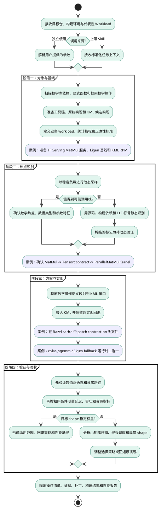
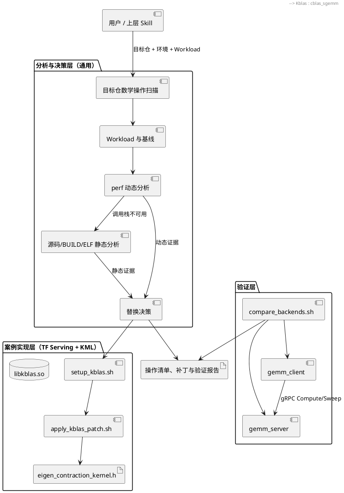
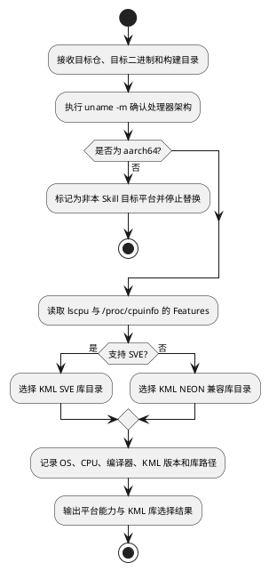
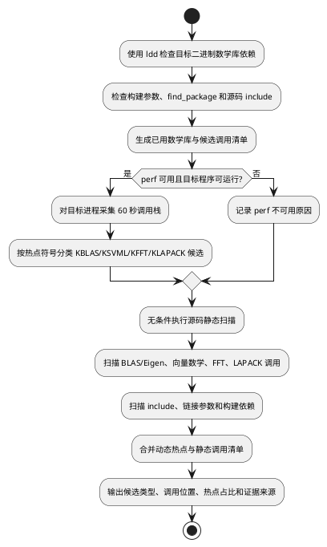
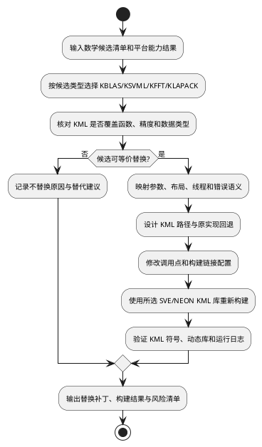
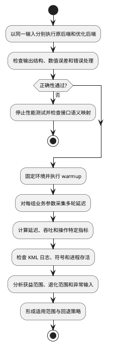

# 数学库鲲鹏亲和优化详设文档——TensorFlow Serving KML 替换案例

## 1. 设计背景

### 1.1 目的

KML 是面向鲲鹏处理器优化的高性能数学库。目标软件即使已经调用 BLAS、Eigen、oneDNN 等数学库或框架内核，也不代表这些实现能够充分发挥鲲鹏处理器的指令、缓存和多核能力。因此，本 Skill 面向一个给定的软件源码仓，识别其中实际使用的数学计算及其底层库函数，评估是否存在可由 KML 承接的热点，并在接口语义和数值正确性满足要求时，将原实现替换为鲲鹏亲和的 KML 实现。

本设计不把“发现函数名后直接替换”作为目标，而是形成“仓库扫描与调用识别、动态热点确认、静态分析兜底、KML 接口匹配、构建集成、正确性验证、性能验收”的完整闭环。通过该闭环，使目标软件的数学计算路径更适合鲲鹏平台，同时保留原实现作为对照和回退。

本 Skill 支持两种使用方式：

1. **独立使用**：用户直接提供目标软件仓、构建环境和代表性 Workload，由本 Skill 完成分析、替换指导、构建验证与性能对比。
2. **被其他 Skill 调用**：上层的源码迁移、鲲鹏亲和分析或整库性能优化 Skill 可以把目标仓信息和 Workload 传入本 Skill，并消费本 Skill 输出的热点证据、替换方案、补丁、构建结果和性能报告。

TensorFlow Serving FP32 MatMul 替换为 KML `cblas_sgemm` 是本文的贯穿案例，用于说明上述通用流程如何落到真实仓库；它不是本 Skill 唯一可分析的数学计算场景。

本期目标如下：

1. **数学操作识别**：在目标仓中识别数学库依赖、函数调用和框架间接调用，并结合运行时热点判断是否值得替换。
2. **KML 亲和替换**：对 KML 能力范围内的数据类型和操作完成接口语义映射、构建接入和回退设计。
3. **结果可归因**：优化前后使用相同程序入口、Workload、线程配置和统计口径，确保收益来自数学内核替换。
4. **过程可复现**：记录源码版本、KML 制品、构建参数、热点证据和基线数据，支持回归与审计。
5. **能力可组合**：定义清晰的输入、输出和阶段性产物，使本 Skill 既能独立执行，也能作为其他 Skill 的数学库优化子流程。

### 1.2 需求背景

| 字段 | 内容 |
| --- | --- |
| Skill 输入 | 目标软件源码仓、目标鲲鹏环境、构建方式、代表性 Workload |
| 通用优化对象 | 目标仓中的数学库调用、框架数学内核及其运行时热点 |
| 实践案例 | TensorFlow Serving 2.17.0 的 Eigen contraction 路径替换为 KML |
| 目标平台 | 鲲鹏 aarch64 / openEuler 20.03 LTS SP3 及以上 |
| 优化库 | boostkit-kml 1.7.0+，运行时依赖 `libkblas.so` |
| 构建环境 | Bazel 7.4.1、GCC 12.3.1+、C++17 |
| Skill 输出 | 数学操作清单、热点证据、KML 可替换性结论、补丁/配置、验证与性能报告 |
| 调用方式 | 独立使用，或由源码迁移/亲和分析/性能优化类 Skill 调用 |
| 功能分解 | 目标仓分析、热点识别、KML 适配与集成、正确性验证、性能验收 |

数学库亲和优化不能从“替换一个函数名”直接开始。首先要识别目标仓使用了哪些显式或间接的数学操作，再证明代表性负载确实消耗在这些操作上，随后确认数据类型、布局、维度、转置语义、线程模型和数值要求，最后才能判断是否适合替换为 KML。本仓库以 TensorFlow Serving 为案例，把 Graph 到 OpKernel 的间接调用、Eigen 模板内联、Bazel external cache、动态库链接和同路径后端切换分别映射到上述通用步骤中。

---

## 2. 模块整体架构设计

### 2.1 架构整体设计

整体过程接收目标仓、构建环境和 Workload 作为统一输入。输入既可以由用户直接提供，也可以由上层 Skill 传入；后续均进入同一套数学操作识别与 KML 替换闭环。TensorFlow Serving/KML 案例在相应阶段给出具体实现和验证证据：



该流程设置四道门禁：没有可复现基线，不进入热点判断；没有动态或静态证据，不进入内核替换；符号与动态库校验失败，不进入功能测试；数值正确性未通过，不接受任何性能结果。

### 2.2 架构分层



对外能力边界如下：独立模式负责引导用户补齐输入并执行完整流程；被调用模式不重复推断上层已经提供的信息，而是接收目标仓路径、平台信息、构建命令和 Workload，并以结构化阶段产物返回。两种模式使用相同的分析和验收标准，避免出现独立调用与组合调用结论不一致。

---

## 3. 组件设计

### 组件一：目标环境与 KML 能力识别

#### 3.1 组件功能整体流程



**流程说明**：

1. **架构确认**：首先执行 `uname -m`，只有目标环境为 `aarch64` 时才进入 KML 鲲鹏亲和替换流程；其他架构只输出识别结果，不执行库替换。
2. **CPU 能力确认**：通过 `lscpu` 和 `/proc/cpuinfo` 检查 `sve` 特征，不能仅依据 CPU 型号推断指令集。
3. **库目录决策**：检测到 SVE 时优先使用 KML SVE 实现；仅支持 NEON 或无法可靠确认特征时使用 NEON 实现，优先保证兼容性。
4. **环境留档**：记录 kernel、CPU、NUMA、编译器、KML 版本和最终选择的动态库路径，后续构建与性能测试必须使用同一结果。
5. **案例映射**：TensorFlow Serving 案例除上述通用检查外，还记录 Bazel 7.4.1、GCC 12.3.1、TF Serving commit、`DISTDIR` 和 Bazel `output_base`，并避免执行 `bazel clean --expunge`。

#### 3.2 接口设计

```bash
uname -m
lscpu | rg -i 'sve|neon'
awk '/^Features/{for(i=2;i<=NF;i++) print $i; exit}' /proc/cpuinfo | \
  rg -i 'sve|asimd'

if lscpu | rg -qi 'sve'; then
  KML_ARCH=sve
  KML_LIB=/usr/local/kml/lib/sve
else
  KML_ARCH=neon
  KML_LIB=/usr/local/kml/lib/neon
fi
```

若 KML 以 RPM 无 root 解包到目标仓，`KML_LIB` 应改为 `third_party/kml` 下实际包含对应 SVE/NEON 动态库的目录。目录不存在时输出阻塞项，不得静默选择其他来源的同名库。

#### 3.3 存储数据设计及描述

- `platform.json`：架构、CPU feature、OS/kernel、编译器和 NUMA 信息。
- `kml-selection.json`：KML 版本、制品校验值、SVE/NEON 决策、include 与 lib 路径。
- TensorFlow Serving 案例额外记录 Bazel 版本、TF commit、`DISTDIR` 与 `output_base`。

---

### 组件二：目标项目数学函数热点分析

#### 3.1 组件功能整体流程



**流程说明**：

1. **当前依赖识别**：对已构建项目使用 `ldd` 查找 BLAS、SLEEF、FFTW、LAPACK、libm、OpenBLAS、ATLAS、MKL 等库；同时扫描构建目录的链接参数和源码 include，覆盖静态链接或尚未进入最终 ELF 的依赖。
2. **动态分析优先**：当 `perf` 可用且程序可运行时，对目标进程全部线程采集调用栈。动态证据用于确定真实 Workload 下的热点占比和调用者。
3. **热点自动分类**：`sgemm/dgemm/gemm/matmul/contract` 归为 KBLAS 候选；`exp/log/sin/cos/tan/pow/sqrt` 归为 KSVML 候选；`fft/dft/rfft/cfft` 归为 KFFT 候选；`solve/factorize/inverse/ev/svd/qr` 归为 KLAPACK 候选。
4. **静态分析始终执行**：静态扫描不是仅在 `perf` 失败时执行。即使已有 perf 结果，也要扫描源码和构建文件，因为运行时 Workload 可能未覆盖冷路径或低频功能。
5. **perf 回退**：无 root 权限、内核工具版本不匹配、容器限制、目标项目尚未编译或无法运行时，记录原因后继续静态分析，不阻断候选发现。
6. **证据合并**：动态命中标记热点占比，静态命中标记源码位置和调用形式；只有静态证据的候选注明“未被当前 Workload 动态覆盖”。
7. **案例映射**：TensorFlow Serving 中除显式 BLAS 关键字外，还要识别 `tfops::MatMul`、`Eigen::Tensor::contract` 和 `ParallelMatMulKernel` 等框架间接调用，并追踪到 Bazel external TensorFlow 源码。

#### 3.2 接口设计

**已链接数学库识别**：

```bash
ldd <target_binary> | \
  rg -i 'blas|sleef|fftw|lapack|libm|openblas|atlas|mkl|vec'
rg -n -- '-l.*(blas|sleef|fftw|lapack)|-lm([^a-z]|$)' <build_dir>
rg -n '#include.*(blas|sleef|fftw|lapack|m\.h|mkl)' <src_dir>
```

**perf 动态采集**：

```bash
if command -v perf >/dev/null 2>&1; then
  perf record -F 99 -g -p <pid> -o /tmp/perf.data -- sleep 60
  perf report -i /tmp/perf.data --stdio --no-children | \
    awk '/^[[:space:]]+[0-9]/{print}' | head -20
fi
```

**源码静态扫描**：

```bash
# KBLAS 候选：BLAS、Eigen GEMM 与框架 contraction
rg -n -g '*.{c,cc,cpp,h,hpp}' \
  'cblas_[sd]gem[mv]|[sd]gemm_|Eigen::Matrix|\.noalias\(\)|\.transpose\(\)|contract' \
  <src_dir>

# KSVML 候选：标量/向量数学函数与 SLEEF/其他向量数学库
rg -n -g '*.{c,cc,cpp,h,hpp}' \
  'Sleef_|sleef|expf?|log10?f?|sinf?|cosf?|tanf?|powf?|sqrtf?|tanhf?|_mm(256)?_.*(exp|log)|vd(Exp|Log)' \
  <src_dir>

# KFFT 候选
rg -n -g '*.{c,cc,cpp,h,hpp}' \
  'fftw_|FFTW_|cufft|DftiCompute|ne10_fft|kiss_fft' <src_dir>

# KLAPACK 候选
rg -n -g '*.{c,cc,cpp,h,hpp}' \
  'LAPACKE_|lapacke_|[ds](gesv|potrf|syev)_|solve|factorize|inverse|svd|qr' \
  <src_dir>

# 构建依赖
rg -n 'find_package.*(BLAS|FFTW|LAPACK|SLEEF)|-l(SLEEF|sleef|blas|openblas|atlas|mkl|fftw|lapack)' \
  <src_dir> <build_dir>
```

扫描规则需要过滤测试、示例、第三方 vendor 和生成文件，避免把非目标代码误判为替换点；过滤目录及理由写入分析报告。

#### 3.3 存储数据设计及描述

- `linked-libraries.txt`：`ldd`、链接参数、include 和构建依赖证据。
- `perf.data`/`perf-report.txt`：动态热点原始数据、build-id、采样命令和 Workload。
- `math-candidates.json`：候选类型、函数名、源码位置、动态占比、静态命中、KML 子库和覆盖状态。

---

### 组件三：KML 替换方案与构建集成

#### 3.1 组件功能整体流程



**通用流程说明**：

1. **子库选择**：根据热点分类选择 KBLAS、KSVML、KFFT 或 KLAPACK，不允许把所有数学函数统一按 GEMM 处理。
2. **能力核对**：检查 KML 版本是否提供目标函数、精度、复数/实数类型、批处理形式和线程模型；无等价接口时保留原实现。
3. **语义映射**：矩阵类操作重点核对布局、M/N/K、转置和 leading dimension；向量数学重点核对精度和特殊值；FFT 重点核对 plan、方向和归一化；LAPACK 重点核对存储、workspace 和返回码。
4. **回退设计**：优化实现必须保留原后端，用于数值对照、性能回归和不适用输入的动态选择。
5. **生效验证**：编译成功不代表替换生效；必须同时验证 KML 目标符号、动态库解析和运行日志。

**案例落地：将 Eigen contraction 替换为 KML**：

TensorFlow Serving 在热点分析中被归类为 KBLAS 候选，随后按上述通用步骤实现为：

1. `setup_kblas.sh` 自动发现 KML 库，补充缺失的 `tf_serving_vendored`，并更新目标工作树 `.bazelrc` 中 `kml_kblas` 的链接路径。
2. `apply_kblas_patch.sh` 通过 `bazel info output_base` 找到 `eigen_contraction_kernel.h`，不修改 WORKSPACE，避免 TensorFlow external 仓库重新 fetch。
3. patch 将 FP32 `dnnl_sgemm` 点改为由 `tf_serving_kblas_enabled` 控制的 `cblas_sgemm`/`tf_serving_eigen_sgemm` 分支，并以 `cblas_sgemm` 标记保证重复执行安全。
4. 脚本对无法识别的 TF 版本打印实际代码片段，并在 `dnnl_sgemm` 仍残留时失败退出。
5. 当前部署模板的 `server.cc` 只解析 `--addr`；目标 TF Serving 集成版本还必须把 `--backend` 接到 `tf_serving_kblas_enabled`。该接线未完成时，不能声称双后端切换有效。

#### 3.2 接口设计

```bash
bash scripts/setup_kblas.sh [BAZEL_BIN] [KML_LIB_DIR]
bash scripts/apply_kblas_patch.sh [BAZEL_BIN]
bash scripts/build_backends.sh [BAZEL_BIN]

nm -D bazel-bin/tf_serving_gemm/tf_gemm_server/gemm_server | \
  grep cblas_sgemm
ldd bazel-bin/tf_serving_gemm/tf_gemm_server/gemm_server | \
  grep kblas
```

`nm` 预期显示 `U cblas_sgemm`，表示符号由动态库提供；`ldd` 必须将 `libkblas.so` 解析到本次记录的 KML 制品目录。运行时还应设置：

```bash
export LD_LIBRARY_PATH="$KML_LIB:${LD_LIBRARY_PATH:-}"
```

#### 3.3 存储数据设计及描述

- `replacement-plan.json`：候选到 KML 子库/API 的映射、可替换性、参数语义和回退条件。
- `changes.patch`：目标仓源码和构建配置变更；TensorFlow Serving 案例另保留 `eigen_contraction_kernel.h.bak_dnnl`。
- `build-verification.txt`：完整构建命令、SVE/NEON 库选择、目标符号、`ldd` 和运行日志。

---

### 组件四：正确性验证与性能验收

#### 3.1 组件功能整体流程



**通用流程说明**：

1. **正确性先行**：使用确定性输入对比参考实现和 KML 实现，覆盖典型参数、边界值、非法参数、特殊浮点值和项目要求的数值容差。
2. **公平测量**：两种实现必须使用相同程序入口、CPU/NUMA、线程、业务参数、warmup 和 iters；性能测试期间避免同时运行导致资源争抢。
3. **分参数决策**：数学库替换不应假定所有输入均获益，应分别统计典型规模和边界输入，并为退化范围保留原实现。
4. **指标适配**：所有候选均统计 avg/P50/P99 和吞吐；KBLAS 可增加 GFLOPS，KFFT 可增加变换/秒，其他子库使用与业务操作匹配的指标。
5. **双重证据**：结果表之外还要保存日志和符号证据，证明测试实际进入了选定的 KML 子库。

**案例落地：通过 GEMM gRPC 服务完成对照验收**：

通用流程要求先验证输出，再在相同条件下比较原实现和候选实现。本案例通过仓库中的 GEMM 服务完成这两个步骤：

1. `GEMMRunner` 创建一次动态形状 Graph 和 `ClientSession`；`Run()` 用 mutex 保护 Session，计时范围覆盖 `ClientSession::Run`。
2. Compute RPC 接收 row-major A、B 和 M/K/N，校验输入元素数，返回 C 及 `server_compute_ms`；Sweep RPC 在服务端生成固定种子矩阵，减少网络传输对纯内核计时的影响。
3. `compare_backends.sh` 启动同一 server binary 的 KBLAS/Eigen 实例，并用同一 client 参数顺序测试。退出 trap 负责回收进程和临时日志。
4. 仓库脚本提供 `shape_sweep` 模式，但当前 `client.cc` 仅实现 `sweep` 和 `compute`；生产 shape 模式在目标集成版本实现并验证前，应标记为待完成项。

#### 3.2 接口设计

```protobuf
rpc Compute(ComputeRequest) returns (ComputeResponse);
rpc Sweep(SweepRequest) returns (SweepResponse);
```

```bash
gemm_server [--addr=0.0.0.0:50052]
gemm_client --host=localhost:50052 --mode=compute \
  --M=512 --K=512 --N=512 --iters=50 --warmup=10
gemm_client --host=localhost:50052 --mode=sweep \
  --sizes=128,256,512,1024,2048 --iters=30 --warmup=5

bash scripts/compare_backends.sh sweep
bash scripts/compare_backends.sh compute \
  --M=2048 --K=2048 --N=2048 --iters=30 --warmup=5
```

#### 3.3 存储数据设计及描述

- 正确性报告保存输入 shape、随机种子、参考输出摘要、最大绝对/相对误差。
- 性能报告保存每次原始延迟、统计结果、线程配置、后端日志和复现命令。
- 基线汇总维护在 `references/performance-baseline.md`；不得仅保留“加速比”而丢失两端原始数据。

---

## 4. 开发者测试

### 4.1 平台能力与资源测试

```bash
git -C "$REPO" rev-parse HEAD
uname -m
lscpu | rg -i 'sve|neon'
sha256sum /tmp/boostkit-kml-1.7.0-1.aarch64.rpm
rpm -qp --queryformat '%{NAME} %{VERSION}-%{RELEASE} %{ARCH}\n' \
  /tmp/boostkit-kml-1.7.0-1.aarch64.rpm
"$BAZEL" --version
```

**验收**：目标仓 commit、KML 制品校验值、aarch64 架构、SVE/NEON 决策、编译器和 CPU/OS 均进入记录；所选 KML 库目录与 CPU 能力一致。TensorFlow Serving 案例额外记录 Bazel、`DISTDIR` 和原始 Eigen 基线。

### 4.2 数学库依赖与动态热点测试

```bash
ldd <target_binary> | \
  rg -i 'blas|sleef|fftw|lapack|libm|openblas|atlas|mkl|vec'
perf record -F 99 -g -p <pid> -o /tmp/perf.data -- sleep 60
perf report -i /tmp/perf.data --stdio --no-children > perf-report.txt
```

**验收**：输出当前数学库依赖；采样期间持续运行固定 Workload；热点按 KBLAS、KSVML、KFFT、KLAPACK 候选分类。`perf` 不可用时记录原因，但仍继续执行静态扫描。

### 4.3 源码静态扫描测试

```bash
rg -n -g '*.{c,cc,cpp,h,hpp}' \
  'cblas_|[sd]gemm_|Sleef_|fftw_|LAPACKE_|expf?|logf?|sinf?|cosf?' \
  <src_dir>
rg -n 'find_package.*(BLAS|FFTW|LAPACK|SLEEF)|-l(blas|openblas|fftw|lapack|sleef)' \
  <src_dir> <build_dir>
```

**验收**：无论 `perf` 是否成功都执行静态扫描；报告包含源码调用、include、链接参数和构建依赖，并过滤测试、示例、vendor 和生成文件。仅静态命中的候选标记为“未被当前 Workload 动态覆盖”。

### 4.4 Patch 幂等与链接测试

```bash
bash scripts/setup_kblas.sh "$BAZEL" "$KML_LIB"
bash scripts/setup_kblas.sh "$BAZEL" "$KML_LIB"
bash scripts/build_backends.sh "$BAZEL"
nm -D bazel-bin/tf_serving_gemm/tf_gemm_server/gemm_server | grep cblas_sgemm
ldd bazel-bin/tf_serving_gemm/tf_gemm_server/gemm_server | grep kblas
```

**验收**：第二次 setup 不重复追加配置或 patch；`cblas_sgemm` 为动态未定义符号；`libkblas.so` 能解析到本次记录的制品目录。

### 4.5 正确性测试

```bash
export LD_LIBRARY_PATH="$KML_LIB:${LD_LIBRARY_PATH:-}"
./bazel-bin/tf_serving_gemm/tf_gemm_server/gemm_server \
  --addr=0.0.0.0:50052
./bazel-bin/tf_serving_gemm/tf_gemm_server/gemm_client \
  --host=localhost:50052 --mode=compute \
  --M=512 --K=512 --N=512 --iters=20 --warmup=5
```

**验收**：输出 shape 为 M×N，数值误差满足项目容差；A/B 元素数与 M/K/N 不一致时返回 `INVALID_ARGUMENT`。目标集成版本还需验证 `--backend` 确实修改运行时开关。

### 4.6 性能验收测试

```bash
bash scripts/compare_backends.sh sweep
bash scripts/compare_backends.sh compute \
  --M=2048 --K=2048 --N=2048 --iters=30 --warmup=5
```

**验收**：两端参数和运行环境一致；每个 shape 均有有效 avg/P50/P99/GFLOPS；日志能确认实际 backend；脚本退出后进程被回收。结果按 shape 给出 KBLAS 适用范围和 Eigen 回退范围。

### 4.7 静态与文档一致性检查

```bash
bash -n scripts/setup_kblas.sh \
  scripts/apply_kblas_patch.sh \
  scripts/build_backends.sh \
  scripts/compare_backends.sh
git diff --check
```

**验收**：Shell 语法与空白检查通过；文档明确区分仓库现有能力与目标 TF Serving 集成能力，特别是当前部署模板尚未直接实现的 `--backend` 和 `shape_sweep` 接线。
